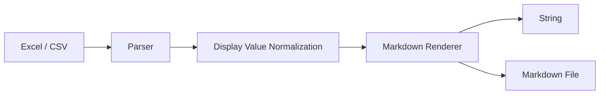

# excel-to-markdown

[English](README.en.md) | [简体中文](README.md) | [🤖 LLM Reference](LLM.md)

[](https://mvnrepository.com/artifact/cn.creekmoon/excel-to-markdown)
[](http://www.apache.org/licenses/LICENSE-2.0.html)
[](https://www.oracle.com/java/technologies/downloads/)

A lightweight Java library for converting `xlsx`, `xls`, and `csv` files into clean, readable Markdown.

It is built for practical documentation workflows:

- turn spreadsheets into Markdown for `README`s, wikis, blogs, or internal docs
- convert pricing tables, config sheets, and mapping tables into AI-friendly plain text
- keep spreadsheet content versionable and reviewable in Git

## Why This Project

Spreadsheets are easy to edit, but not ideal for documentation, code review, or knowledge indexing.

`excel-to-markdown` focuses on one thing: extracting tabular content into Markdown that is easier to read, diff, archive, and reuse.

## Highlights

- **Works out of the box**: simple utility methods, no framework required
- **Readable output first**: tries to preserve what people actually see in Excel
- **Large-file friendly**: `xlsx` is parsed with SAX to avoid loading the whole workbook into memory
- **Documentation-ready**: output is standard Markdown, easy to store and publish

## At A Glance

`Excel / CSV -> parsing -> display-value normalization -> Markdown rendering -> String / .md file`



| Item | Details |
| --- | --- |
| Project type | Java utility library |
| Input formats | `xlsx`, `xls`, `csv` |
| Output forms | `String` or `.md` file |
| Good at | Multi-sheet export, text-block detection, newline and pipe escaping |

## Installation

```xml
<dependency>
    <groupId>cn.creekmoon</groupId>
    <artifactId>excel-to-markdown</artifactId>
    <version>1.2.0</version>
</dependency>
```

If your project still runs on **JDK 8**, use the compatibility artifact:

```xml
<dependency>
    <groupId>cn.creekmoon</groupId>
    <artifactId>excel-to-markdown-jdk8</artifactId>
    <version>1.2.0</version>
</dependency>
```

> Note: `excel-to-markdown-jdk8` provides the same features as the main branch, with syntax downgraded for JDK 8 compatibility.

## Quick Start

```java
import cn.creekmoon.excel2markdown.Excel2MarkdownUtils;

import java.io.File;

public class Demo {
    public static void main(String[] args) {
        String markdown = Excel2MarkdownUtils.xlsx2Markdown(new File("demo.xlsx"));
        System.out.println(markdown);
    }
}
```

If your CSV looks like this:

```csv
name,age,city
Alice,28,Beijing
Bob,32,Shanghai
Carol,25,Guangzhou
```

The output will look like this:

```md
| name | age | city |
| --- | --- | --- |
| Alice | 28 | Beijing |
| Bob | 32 | Shanghai |
| Carol | 25 | Guangzhou |
```

## Common Usage

### Convert `xlsx` to a Markdown string

```java
String markdown = Excel2MarkdownUtils.xlsx2Markdown(new File("report.xlsx"));
```

### Convert `xls` to a Markdown string

```java
String markdown = Excel2MarkdownUtils.xls2Markdown(new File("report.xls"));
```

### Convert `csv` to Markdown

```java
String markdown = Excel2MarkdownUtils.csv2Markdown(new File("table.csv"));
```

### Write directly to a Markdown file

```java
Excel2MarkdownUtils.xlsx2MarkdownFile(
        new File("report.xlsx"),
        new File("report.md")
);
```

Also available:

- `xls2MarkdownFile(...)`
- `csv2MarkdownFile(...)`

### Convert from `InputStream`

```java
try (InputStream inputStream = Files.newInputStream(Path.of("report.xlsx"))) {
    String markdown = Excel2MarkdownUtils.xlsx2Markdown(inputStream);
    System.out.println(markdown);
}
```

## API Overview

All methods have overloaded variants accepting a `MarkdownOutputStrategy` parameter. When omitted, `WYSIWYG` is used by default.

| Method | Description |
| --- | --- |
| `xlsx2Markdown(File)` | `xlsx -> String`, WYSIWYG strategy |
| `xlsx2Markdown(File, MarkdownOutputStrategy)` | `xlsx -> String`, chosen strategy |
| `xlsx2Markdown(InputStream)` | `xlsx -> String`, WYSIWYG strategy |
| `xlsx2Markdown(InputStream, MarkdownOutputStrategy)` | `xlsx -> String`, chosen strategy |
| `xlsx2MarkdownFile(File, File)` | `xlsx -> Markdown file`, WYSIWYG strategy |
| `xlsx2MarkdownFile(File, File, MarkdownOutputStrategy)` | `xlsx -> Markdown file`, chosen strategy |
| `xlsx2MarkdownFile(InputStream, File)` | `xlsx -> Markdown file`, WYSIWYG strategy |
| `xlsx2MarkdownFile(InputStream, File, MarkdownOutputStrategy)` | `xlsx -> Markdown file`, chosen strategy |
| `xls2Markdown(File)` | `xls -> String`, WYSIWYG strategy |
| `xls2Markdown(File, MarkdownOutputStrategy)` | `xls -> String`, chosen strategy |
| `xls2Markdown(InputStream)` | `xls -> String`, WYSIWYG strategy |
| `xls2Markdown(InputStream, MarkdownOutputStrategy)` | `xls -> String`, chosen strategy |
| `xls2MarkdownFile(File, File)` | `xls -> Markdown file`, WYSIWYG strategy |
| `xls2MarkdownFile(File, File, MarkdownOutputStrategy)` | `xls -> Markdown file`, chosen strategy |
| `xls2MarkdownFile(InputStream, File)` | `xls -> Markdown file`, WYSIWYG strategy |
| `xls2MarkdownFile(InputStream, File, MarkdownOutputStrategy)` | `xls -> Markdown file`, chosen strategy |
| `csv2Markdown(File)` | `csv -> String`, WYSIWYG strategy |
| `csv2Markdown(File, MarkdownOutputStrategy)` | `csv -> String`, chosen strategy |
| `csv2Markdown(InputStream)` | `csv -> String`, WYSIWYG strategy |
| `csv2Markdown(InputStream, MarkdownOutputStrategy)` | `csv -> String`, chosen strategy |
| `csv2MarkdownFile(File, File)` | `csv -> Markdown file`, WYSIWYG strategy |
| `csv2MarkdownFile(File, File, MarkdownOutputStrategy)` | `csv -> Markdown file`, chosen strategy |
| `csv2MarkdownFile(InputStream, File)` | `csv -> Markdown file`, WYSIWYG strategy |
| `csv2MarkdownFile(InputStream, File, MarkdownOutputStrategy)` | `csv -> Markdown file`, chosen strategy |

## Output Strategies

All conversion methods accept a `MarkdownOutputStrategy` to control how the table is rendered.

### WYSIWYG (default)

No row numbers or column letters are added. The first row of data becomes the Markdown table header, preserving the visual appearance of the spreadsheet.

```java
// equivalent to passing MarkdownOutputStrategy.WYSIWYG explicitly
String markdown = Excel2MarkdownUtils.xlsx2Markdown(new File("report.xlsx"));
```

### NATIVE_COORDINATES

Annotates every table with a short note, uses Excel column letters (`A`, `B`, `C` …) as the header row, and prepends a 1-based row number to each data row. The top-left cell is labelled `Rows`.

```java
String markdown = Excel2MarkdownUtils.xlsx2Markdown(
        new File("report.xlsx"),
        MarkdownOutputStrategy.NATIVE_COORDINATES
);
```

Sample output:

```md
> Note: Column headers use Excel column letters (A, B, C ...). Row numbers reflect the native row index starting from 1.

| Rows | A | B | C |
| --- | --- | --- | --- |
| 1 | name | age | city |
| 2 | Alice | 28 | Beijing |
| 3 | Bob | 32 | Shanghai |
```

## Output Behavior

Each sheet is rendered as a single complete Markdown table. Every row in the sheet becomes a table row.

### Multi-sheet workbooks are expanded in order

Each sheet is prefixed with a level-1 heading, followed by one table:

```md
# Sheet1

| ... |

# Sheet2

| ... |
```

Blank rows in the sheet appear as empty rows in the table so that row positions stay aligned with the original spreadsheet.

### Newlines inside cells become `<br>`

This keeps the content while preserving valid Markdown table structure.

### `|` inside cells is escaped automatically

So Markdown does not mistake content for a column separator.

## Best Fit

This project is a good fit when you want spreadsheet content to become a predictable, position-preserving grid that LLMs or documentation tools can consume directly.

Great for:

- documentation repositories
- knowledge bases
- AI / RAG preprocessing
- pricing tables and configuration sheets
- tabular content that should be reviewable in Git

## Current Limitations

What it does well:

- reading tabular content
- multi-sheet output
- common numeric and date display formatting
- CSV edge cases such as quotes, newlines, and pipe characters

What it does not aim to fully preserve:

- Excel styling, colors, borders, and images
- merged-cell visual layout
- full recalculation of complex formulas
- exact page-layout reproduction from Excel

Notes:

- in SAX mode, `xlsx` conversion mainly relies on already available display values
- `csv` does not carry Excel-style formatting metadata, so it is treated as plain text data

## Development

### Requirements

- **Main branch**: JDK `17+`
- **JDK 8 compatibility branch**: use `excel-to-markdown-jdk8` without upgrading your JDK
- Maven `3.9+`

### Run Tests

```bash
mvn test
```

The test suite covers:

- `xlsx`, `xls`, and `csv` conversion
- file and `InputStream` entry points
- UTF-8 output with Chinese content
- multi-sheet rendering
- pipe escaping and multiline cell handling
- invalid and empty input cases

## License

[Apache License 2.0](http://www.apache.org/licenses/LICENSE-2.0.html)

## Contributing

Issues and pull requests are welcome.

If you find a weird real-world spreadsheet edge case, that is especially valuable. Tools like this become better by learning from messy input, not just perfect sample files.
