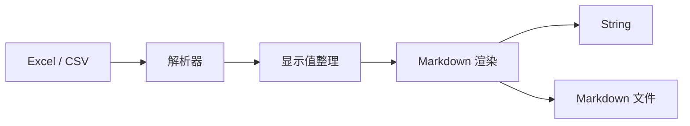

# excel-to-markdown

[简体中文](README.md) | [English](README.en.md) | [🤖 LLM 用法参考](LLM.md)

[](https://mvnrepository.com/artifact/cn.creekmoon/excel-to-markdown)
[](http://www.apache.org/licenses/LICENSE-2.0.html)
[](https://www.oracle.com/java/technologies/downloads/)

一个轻量的 Java 工具库，用来把 `xlsx`、`xls`、`csv` 转成干净可读的 Markdown。

它适合这些场景：

- 把 Excel 表格贴进 `README`、知识库、博客或项目文档
- 把报价表、配置表、对照表转成适合 AI / RAG 使用的纯文本
- 把多 Sheet 的表格资料整理成一份可版本管理的 Markdown 文件

## 设计理念

- **开箱即用**：直接调用工具类，不需要引入额外框架
- **优先保留可读性**：尽量还原 Excel 里“人看到的内容”，而不是只吐原始值
- **对大文件更友好**：`xlsx` 使用 SAX 流式解析，避免把整本工作簿一次性吃进内存
- **输出适合文档化**：结果是标准 Markdown，便于保存、对比、审阅和二次加工

## 一屏了解

一句话流程：`Excel / CSV -> 解析 -> 显示值格式化 -> Markdown 渲染 -> String / .md 文件`



| 项 | 说明 |
| --- | --- |
| 项目形态 | Java 工具库 |
| 输入格式 | `xlsx`、`xls`、`csv` |
| 输出形式 | `String` 或 `.md` 文件 |
| 主要特点 | 多 Sheet 输出、文本块识别、换行与管道符转义 |

## 快速开始

### 1. 引入依赖

```xml
<dependency>
    <groupId>cn.creekmoon</groupId>
    <artifactId>excel-to-markdown</artifactId>
    <version>1.2.0</version>
</dependency>
```

如果你的项目仍在使用 **JDK 8**，请引入兼容分支的坐标：

```xml
<dependency>
    <groupId>cn.creekmoon</groupId>
    <artifactId>excel-to-markdown-jdk8</artifactId>
    <version>1.2.0</version>
</dependency>
```

> 说明：`excel-to-markdown-jdk8` 与主分支功能完全一致，仅将语法降级到 JDK 8 兼容范围。

### 2. 最短示例

```java
import cn.creekmoon.excel2markdown.Excel2MarkdownUtils;

import java.io.File;

public class Demo {
    public static void main(String[] args) {
        String markdown = Excel2MarkdownUtils.xlsx2Markdown(new File("demo.xlsx"));
        System.out.println(markdown);
    }
}
```

如果你的输入是一个简单 CSV：

```csv
姓名,年龄,城市
张三,28,北京
李四,32,上海
王五,25,广州
```

输出会是：

```md
| 姓名 | 年龄 | 城市 |
| --- | --- | --- |
| 张三 | 28 | 北京 |
| 李四 | 32 | 上海 |
| 王五 | 25 | 广州 |
```

## 常见用法

### 场景一：把 xlsx 转成 Markdown 字符串

适合直接拿结果继续拼提示词、写文档或者做二次处理。

```java
String markdown = Excel2MarkdownUtils.xlsx2Markdown(new File("report.xlsx"));
```

### 场景二：把 xls 转成 Markdown 字符串

老版本 Excel 文件也可以直接处理。

```java
String markdown = Excel2MarkdownUtils.xls2Markdown(new File("report.xls"));
```

### 场景三：把 csv 转成 Markdown

```java
String markdown = Excel2MarkdownUtils.csv2Markdown(new File("table.csv"));
```

### 场景四：直接输出到 Markdown 文件

适合把转换结果落盘，接进文档流水线或静态内容仓库。

```java
Excel2MarkdownUtils.xlsx2MarkdownFile(
        new File("report.xlsx"),
        new File("report.md")
);
```

同样也支持：

- `xls2MarkdownFile(...)`
- `csv2MarkdownFile(...)`

### 场景五：从 InputStream 转换

适合文件上传、对象存储下载流、网络流等场景。

```java
try (InputStream inputStream = Files.newInputStream(Path.of("report.xlsx"))) {
    String markdown = Excel2MarkdownUtils.xlsx2Markdown(inputStream);
    System.out.println(markdown);
}
```

## API 一览

所有方法均有带 `MarkdownOutputStrategy` 参数的重载版本，省略时默认使用 `WYSIWYG`（所见即所得）。

| 方法 | 说明 |
| --- | --- |
| `xlsx2Markdown(File)` | `xlsx -> String`，WYSIWYG 策略 |
| `xlsx2Markdown(File, MarkdownOutputStrategy)` | `xlsx -> String`，指定策略 |
| `xlsx2Markdown(InputStream)` | `xlsx -> String`，WYSIWYG 策略 |
| `xlsx2Markdown(InputStream, MarkdownOutputStrategy)` | `xlsx -> String`，指定策略 |
| `xlsx2MarkdownFile(File, File)` | `xlsx -> Markdown 文件`，WYSIWYG 策略 |
| `xlsx2MarkdownFile(File, File, MarkdownOutputStrategy)` | `xlsx -> Markdown 文件`，指定策略 |
| `xlsx2MarkdownFile(InputStream, File)` | `xlsx -> Markdown 文件`，WYSIWYG 策略 |
| `xlsx2MarkdownFile(InputStream, File, MarkdownOutputStrategy)` | `xlsx -> Markdown 文件`，指定策略 |
| `xls2Markdown(File)` | `xls -> String`，WYSIWYG 策略 |
| `xls2Markdown(File, MarkdownOutputStrategy)` | `xls -> String`，指定策略 |
| `xls2Markdown(InputStream)` | `xls -> String`，WYSIWYG 策略 |
| `xls2Markdown(InputStream, MarkdownOutputStrategy)` | `xls -> String`，指定策略 |
| `xls2MarkdownFile(File, File)` | `xls -> Markdown 文件`，WYSIWYG 策略 |
| `xls2MarkdownFile(File, File, MarkdownOutputStrategy)` | `xls -> Markdown 文件`，指定策略 |
| `xls2MarkdownFile(InputStream, File)` | `xls -> Markdown 文件`，WYSIWYG 策略 |
| `xls2MarkdownFile(InputStream, File, MarkdownOutputStrategy)` | `xls -> Markdown 文件`，指定策略 |
| `csv2Markdown(File)` | `csv -> String`，WYSIWYG 策略 |
| `csv2Markdown(File, MarkdownOutputStrategy)` | `csv -> String`，指定策略 |
| `csv2Markdown(InputStream)` | `csv -> String`，WYSIWYG 策略 |
| `csv2Markdown(InputStream, MarkdownOutputStrategy)` | `csv -> String`，指定策略 |
| `csv2MarkdownFile(File, File)` | `csv -> Markdown 文件`，WYSIWYG 策略 |
| `csv2MarkdownFile(File, File, MarkdownOutputStrategy)` | `csv -> Markdown 文件`，指定策略 |
| `csv2MarkdownFile(InputStream, File)` | `csv -> Markdown 文件`，WYSIWYG 策略 |
| `csv2MarkdownFile(InputStream, File, MarkdownOutputStrategy)` | `csv -> Markdown 文件`，指定策略 |

## 输出策略

转换方法支持两种输出策略，通过 `MarkdownOutputStrategy` 枚举选择。

### WYSIWYG（默认）

"所见即所得"，不附加行号和列号。数据第一行直接作为 Markdown 表格标题行，还原你在 Excel 里直接看到的样子。

```java
// 等价于显式传入 MarkdownOutputStrategy.WYSIWYG
String markdown = Excel2MarkdownUtils.xlsx2Markdown(new File("report.xlsx"));
```

### NATIVE_COORDINATES

输出原生坐标轴。表格标题行使用 Excel 列字母（A、B、C…），每行数据前追加 1-based 行号，左上角占位为 `Rows`。适合需要精确定位单元格、做坐标引用或喂给 LLM 时携带位置信息的场景。

```java
String markdown = Excel2MarkdownUtils.xlsx2Markdown(
        new File("report.xlsx"),
        MarkdownOutputStrategy.NATIVE_COORDINATES
);
```

输出示例：

```md
> Note: Column headers use Excel column letters (A, B, C ...). Row numbers reflect the native row index starting from 1.

| Rows | A | B | C |
| --- | --- | --- | --- |
| 1 | 姓名 | 年龄 | 城市 |
| 2 | 张三 | 28 | 北京 |
| 3 | 李四 | 32 | 上海 |
```

## 输出规则

这个项目尽量让输出适合人阅读，而不是只吐原始值。

### 1. 多 Sheet 会顺序展开

如果源文件有多个 Sheet，输出会按顺序拼成一份 Markdown，每个 Sheet 以一级标题开头：

```md
# Sheet1

| ... |

# Sheet2

| ... |
```

### 2. 单元格里的换行会转成 `<br>`

这样既保留信息，也不会破坏 Markdown 表格结构。

### 3. 单元格里的 `|` 会自动转义

避免 Markdown 把内容误判成分隔列。

## 当前适用边界

这个库更适合“把表格内容转成文档友好的文本”，而不是做 100% 视觉还原。

目前已经比较稳定支持的，是这些能力：

- 表格内容读取
- 多 Sheet 输出
- 常见数字 / 日期显示值格式化
- `csv` 的引号、换行、管道符等常见边界处理

暂时不以这些目标为主：

- 保留 Excel 样式、颜色、边框、图片
- 完整表达合并单元格视觉效果
- 重新计算复杂公式结果
- 把 Excel 页面布局原样复刻成 Markdown

补充说明：

- `xlsx` 在 SAX 模式下默认更偏向读取已有显示结果，适合文档化转换场景
- `csv` 本身没有 Excel 那种格式元数据，所以它输出的是文本语义，而不是“单元格样式语义”

## 适合谁用

- 需要把 Excel 内容沉淀进 Git 仓库的人
- 需要把表格喂给大模型、向量库或检索系统的人
- 需要快速把报价矩阵、配置清单、映射表转成 Markdown 的开发者
- 想在 Java 项目里用一个轻量依赖完成转换的人

## 本地开发

### 环境要求

- **主分支**：JDK `17+`
- **JDK 8 兼容分支**：使用 `excel-to-markdown-jdk8`，无需升级 JDK
- Maven `3.9+`

### 运行测试

```bash
mvn test
```

测试中已经覆盖了这些典型场景：

- `xlsx`、`xls`、`csv` 基础转换
- 文件和 `InputStream` 两种入口
- 中文内容与 UTF-8 写出
- 多 Sheet 输出
- 管道符转义、单元格换行处理
- 异常输入与空输入处理

## License

[Apache License 2.0](http://www.apache.org/licenses/LICENSE-2.0.html)

## 反馈与贡献

如果你在真实表格里遇到了边界情况，欢迎提 Issue 或直接补测试用例。  
这类工具库最有价值的地方，往往就是不断把“真实世界里的奇怪表格”收敛成稳定行为。
