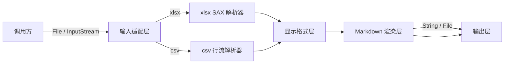

# excel2markdown 技术实现文档

- **文档类型**：技术实现文档（TRD）
- **关联 PRD**：无（开源工具库，需求来自设计指标说明）
- **适用对象**：架构师、技术组长、核心开发
- **评审状态**：草稿

| 版本号 | 更新时间   | 作者 | 备注 |
|--------|------------|------|------|
| v1.0   | 2026-04-09 | JY   | 初版 |

---

## 0. 一屏摘要

**一句话方案**：调用方传入 `.xlsx` 或 `.csv` 文件 → 输入适配层统一接入 → 解析层流式逐行读取 → 显示格式层归一化单元格显示值 → Markdown 渲染层生成表格文本 → 输出层写出 `String` 或 `File`。

> 输入适配层负责格式嗅探与路由；解析层各自处理 xlsx/csv 行流；显示格式层统一负责数字/日期显示值还原；渲染层只关心 Markdown 语法规则；输出层不感知上游格式。

### 关键技术决策（ADR）

| 决策点 | 选择 | 备选 | 选择理由 |
|--------|------|------|----------|
| xlsx 读取策略 | POI SAX 事件流 | POI DOM（UserModel） | SAX 不全量加载工作簿，内存峰值低；适合大文件场景 |
| csv 解析方式 | 标准行扫描（无额外依赖） | OpenCSV / Commons-CSV | 保持轻量，csv 语义简单，无需引入第三方依赖 |
| 数字/日期格式还原 | 复用 POI 的 `DataFormatter` 机制 | 自行实现格式规则 | POI 已内置 Excel 格式字符串解析，与 Excel 显示一致，避免重复造轮子 |
| Markdown 保真目标 | table-first，优先显示值正确 | 完全视觉还原（引入 HTML） | Markdown 本身不支持合并单元格/样式；强行用 HTML 会破坏轻量原则 |
| 输入抽象 | 统一 `InputStream` 转换 | 各入口分别处理 | 统一底层后，`File` / `URL` / `byte[]` 等都可在适配层转换，核心模块不感知差异 |
| 输出抽象 | 渲染结果为 `String`，再由输出层路由 | 直接按输出目标分支写出 | 渲染与输出解耦，便于扩展新的输出目标（如 Writer / Path） |

### 模块职责表

| 模块 | 职责（一句话） | 输入 | 输出 | 边界 |
|------|--------------|------|------|------|
| 输入适配层 | 接收外部入参，识别格式并路由 | `File`、`InputStream`、`byte[]` | 格式类型标记 + 标准 `InputStream` | 不做内容解析 |
| xlsx SAX 解析器 | 以 SAX 事件流逐行读取 xlsx | `InputStream`（xlsx） | 逐行单元格原始值 + 格式下标 | 不负责格式显示值计算 |
| csv 行流解析器 | 逐行读取 csv，处理引号/换行转义 | `InputStream`（csv） | 逐行字符串数组 | csv 无格式元数据，所有值均为字符串 |
| 显示格式层 | 将原始值 + 格式下标还原为 Excel 显示值 | 原始值 + 格式下标 | 显示值字符串 | 仅处理数字/日期/时间；csv 直传不处理 |
| Markdown 渲染层 | 将行数据拼装为合规 Markdown 表格文本 | 逐行显示值数组 | Markdown 字符串 | 不处理合并单元格/样式/图片 |
| 输出层 | 将渲染结果写出到目标 | Markdown 字符串 | `String` / `File` | 不做渲染，不感知 Excel/csv 差异 |
| 配置模型 | 承载 sheet 选择、编码、公式求值等调用选项 | 调用方配置 | 各层读取配置 | 不持有运行状态 |
| 错误模型 | 定义错误类型与降级行为语义 | 各层抛出的异常 | 标准化错误信息或降级空值 | 不负责 UI 层展示 |

### 接口清单

| 能力 | 调用方向 | 方式 | 目的 |
|------|----------|------|------|
| 转为 String | 调用方 → 库 | 同步调用 | 将 xlsx/csv 转为 Markdown 字符串，适合内存操作 |
| 转为 File | 调用方 → 库 | 同步调用 | 将 xlsx/csv 转换结果写出到目标文件，适合大文件 |
| 多 sheet 输出 | 调用方 → 库 | 同步调用 | xlsx 默认输出所有 sheet，每个 sheet 以一级标题（sheet 名）+ 表格形式合并到同一份 Markdown |
| 公式求值策略 | 调用方 → 配置模型 | 配置选项 | 可选强制刷新公式；默认读取上次计算的缓存值，刷新失败时降级为缓存值 |

---

## 1. 需求到技术映射

| 设计指标 | 技术实现策略 |
|----------|-------------|
| 轻量 | 核心依赖仅 POI SAX；csv 解析无额外依赖；不引入 Spring/ORM 等框架组件 |
| 低内存 | xlsx 走 SAX 事件流，不加载整个工作簿 DOM；逐行读取逐行渲染；输出 File 时流式写入 |
| 简易使用 | 单一公共入口，支持 `File`、`InputStream` 等多种入参；链式配置可选 |
| 所见即所得 | 以 Excel 显示值（格式化后）为准；数字/日期/时间按 Excel 格式字符串还原 |
| 多种输入 | 输入适配层统一转换，支持 `File`、`InputStream`；格式嗅探由文件头或扩展名辅助判断 |
| 多种输出 | 输出层抽象，当前支持 `String`、`File`；后续可扩展 `Writer`、`Path` |

---

## 2. 模块划分与职责边界

### 输入适配层

- **职责**：识别输入格式（xlsx / csv），统一包装为内部读取会话，路由到对应解析器
- **边界**：不做任何内容解析；不持有解析状态
- **对外能力**：接受 `File`、`InputStream`、`byte[]`；向下游提供格式类型标记与标准流
- **依赖**：无外部依赖

### xlsx SAX 解析器

- **职责**：以 POI SAX 事件驱动方式逐行读取 xlsx，提取每格的原始值与格式下标
- **边界**：不负责格式显示值计算；不处理图片、批注、公式求值
- **对外能力**：逐行回调，每行提供单元格原始值数组与对应格式下标
- **依赖**：`poi-ooxml`、`xerces`

### csv 行流解析器

- **职责**：逐行读取 csv，处理引号包裹、字段内换行、转义等标准 RFC 4180 边界情况
- **边界**：csv 无格式元数据，所有值直接以字符串输出；不推断数字/日期类型
- **对外能力**：逐行回调，每行提供字符串数组
- **依赖**：仅 JDK 标准库

### 显示格式层

- **职责**：将 xlsx 单元格原始值（数字存储值）结合 Excel 格式字符串，还原为用户在 Excel 中看到的显示值
- **边界**：仅处理数值型和日期型；文本型直传；csv 来源的行直接跳过此层
- **对外能力**：输入原始值 + 格式下标，输出与 Excel 显示一致的显示值字符串
- **依赖**：POI `DataFormatter`

### Markdown 渲染层

- **职责**：将逐行的显示值数组拼装为标准 GitHub Flavored Markdown 表格文本，处理单元格内容转义（含 `|`、换行等）
- **边界**：不处理合并单元格（跳过合并区域或展开为独立单元格）；不处理图片、样式
- **对外能力**：接受表头行与数据行流，输出完整 Markdown 字符串
- **依赖**：无外部依赖

### 输出层

- **职责**：将 Markdown 字符串写出到指定目标（String 返回 / 文件写入）
- **边界**：不做内容加工；不感知上游格式差异
- **对外能力**：支持 `String` 返回、`File` 写入；编码默认 UTF-8，可配置
- **依赖**：JDK 标准 I/O

---

## 3. 接口契约

| 接口/能力 | 调用方向 | 方式 | 目的 | 幂等 | 失败策略 |
|-----------|----------|------|------|------|----------|
| xlsx → String | 调用方 → 核心入口 | 同步 | 将指定 sheet 转为 Markdown 字符串 | 是 | 抛结构化异常，含失败原因 |
| xlsx → File | 调用方 → 核心入口 | 同步 | 将指定 sheet Markdown 写出到文件 | 是 | 同上，文件不存在则创建，已存在则覆盖 |
| csv → String | 调用方 → 核心入口 | 同步 | 将 csv 转为 Markdown 字符串 | 是 | 抛结构化异常，含失败原因 |
| csv → File | 调用方 → 核心入口 | 同步 | 将 csv Markdown 写出到文件 | 是 | 同上 |
| 多 sheet 输出 | 调用方 → 核心入口 | 同步 | 默认将所有 sheet 输出为同一份 Markdown，每个 sheet 以一级标题（sheet 名）+ 表格形式展开 | 是 | 单个 sheet 失败不阻断，可选 fail-fast |
| sheet 选择 | 调用方 → 配置模型 | 构建时配置 | 指定 sheet 名或下标，默认第 0 个 | N/A | sheet 不存在则抛出明确错误 |
| 公式求值策略 | 调用方 → 配置模型 | 构建时配置 | 可选项，控制是否强制刷新公式（依赖 POI FormulaEvaluator）；默认读取缓存值 | N/A | 公式刷新失败时降级为缓存值，不中断转换 |

**csv 与 xlsx 的统一抽象差异说明**：

- csv 不携带数字/日期格式元数据，显示格式层对 csv 源数据直传，所有值以原始字符串输出
- xlsx 通过 SAX 事件获取格式下标，显示格式层可按 Excel 格式字符串还原显示值
- 调用方无需区分来源，统一使用相同调用入口；差异由适配层内部处理

---

## 4. NFR 与风险

### 非功能性需求

| 维度 | 要求 | 实现策略 |
|------|------|----------|
| 内存 | 单次转换内存峰值可控，不随行数线性膨胀 | xlsx SAX 事件流，不加载全表 DOM；逐行缓冲渲染；输出 File 时流式写入 |
| 性能 | 10 万行 xlsx 转换耗时可接受（参考：秒级） | SAX 读取天然流式，无 DOM 构建开销；Markdown 拼装为线性操作 |
| 依赖体积 | 不引入非必要重量级依赖 | 核心仅依赖 poi-ooxml + xerces；csv 使用 JDK 标准库 |
| 健壮性 | 对异常输入有可预测的失败行为，不静默吞掉错误 | 空 sheet 返回空字符串；非法格式字符串降级为原始值；错误包含行/列定位 |
| 编码兼容 | 支持中文、多语言字符 | 默认 UTF-8；csv 读取时支持显式指定编码 |

### 主要风险

- **合并单元格无法完整还原**：Markdown 表格不支持跨行/跨列合并；当前策略是展开为独立单元格（合并区域首个保留值，其余为空），存在信息损失，需在文档与 API 注释中明确告知调用方
- **csv 格式语义缺失**：csv 没有数字/日期格式元数据，`1000000` 与 `1,000,000` 在 csv 里是两个不同的字符串，格式层无法还原显示意图；调用方需自行确认 csv 来源的数据质量
- **公式单元格**：xlsx SAX 模式读取公式时，默认只能获取上次计算的缓存值，不重新执行公式；若工作簿未保存过计算结果，公式单元格可能为空或错误值
- **超大单元格内容**：单元格内含换行或 `|` 字符时，Markdown 渲染层需转义；长文本不截断，但可能影响 Markdown 表格可读性
- **格式字符串边界**：极少数自定义 Excel 格式字符串（如条件格式、颜色标记）POI DataFormatter 支持有限，边界情况下降级为原始值，不报错

---

## 5. 演进规划

- **当前版本（MVP）**：`.xlsx + csv` 输入，单元格显示值转 Markdown 表格，基础数字/日期格式还原，多输入类型（File / InputStream），多输出类型（String / File）；xlsx 默认输出所有 sheet 页，每个 sheet 以一级标题（sheet 名称）+ 表格形式顺序展开在同一份 Markdown 中；公式求值策略为可选项，支持调用方传入是否强制刷新公式（依赖 POI FormulaEvaluator）
